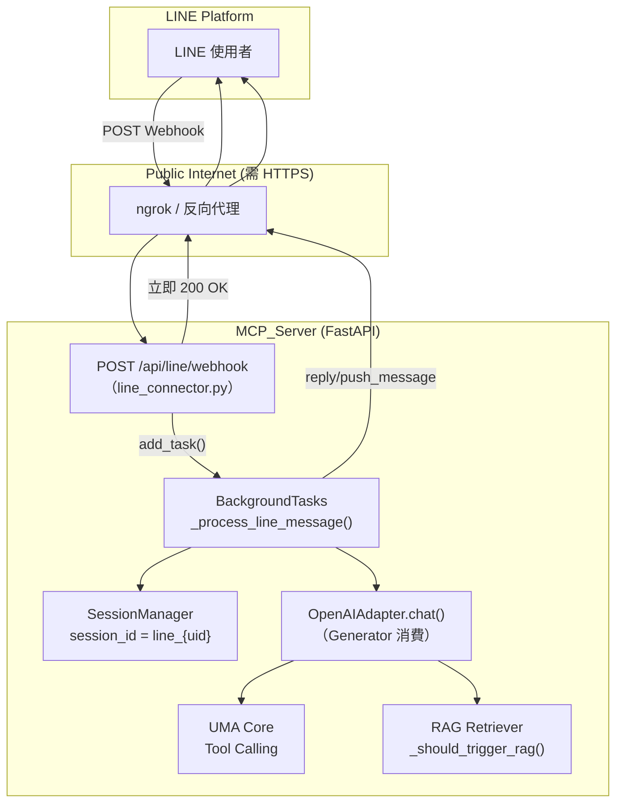

# LINE × MCP_Server 整合：深度交叉分析實作報告

> **分析日期**：2026-03-11 ｜ **版本基線**：MCP_Server current（router.py 1784L）  
> **目標**：評估將 LINE Messaging API 嫁接進現有 FastAPI + UMA 架構的可行性、衝突點與完整落地策略。

---

## 第一部分：架構三層映射（Clarification）

將 OpenClaw 的三層概念對應至 MCP_Server 的實際程式碼：

| OpenClaw 概念 | MCP_Server 對應 | 映射說明 |
|---|---|---|
| **Inbound**（事件進來） | `router.py` 新增 `/api/line/webhook` | 接收 LINE HTTP POST、驗證 X-Line-Signature、解析 Events |
| **Session**（會話路由） | `core/session.py` → `SessionManager` | `line_{user_id}` 直接映射 `session_id`；`get_or_create_conversation()` 完美重用 |
| **Outbound**（回覆送出） | `adapters/*_adapter.py` + LINE SDK | 現有 Generator 流消費後組裝完整字串，透過 `line_bot_api.reply_message()` 回傳 |

**✅ 結論**：三層映射完全兼容；無需修改現有 UMA/Session 核心邏輯。

---

## 第二部分：交叉衝突分析（Cross-Analysis）

### 2.1 🔴 關鍵衝突：生命週期 vs. Webhook Timeout

這是本次整合**最核心的技術挑戰**。

| 面向 | 現有 Web 架構 | LINE Webhook 限制 |
|---|---|---|
| **回覆模式** | SSE 串流（`EventSourceResponse`），連線保持數秒 | **必須在 1~2 秒內回 HTTP 200 OK** |
| **LLM 延遲** | GPT-4o 首字延遲約 1~3 秒，全文可能 10~30 秒 | 超時即判斷失敗並重送 Webhook |
| **Generator 型態** | `openai_adapter.chat()` 是 Python **generator**（用 `yield`） | 背景執行緒無法直接接收 async generator |

**潛在問題（若不處理）**：若在 Webhook 處理函數中直接 `await adapter.chat()`，LINE Server 收不到及時的 200 OK，會觸發**重複投遞（Duplicate Delivery）**，導致機器人重複回覆。

#### 解法：BackgroundTasks 非同步解耦（架構圖已建議）

`router.py` 已 import `BackgroundTasks`（第 24 行），直接可用：

```python
# router.py L24（確認已存在）
from fastapi import FastAPI, ..., BackgroundTasks, ...
```

> [!IMPORTANT]
> `openai_adapter.chat()` 是**同步 generator**（`def chat()`），而 `openai_adapter.simple_chat()` 亦同。在背景函數（非 async context）中直接 `for chunk in adapter.chat(...)` 消費即可，**不需要 asyncio**。

---

### 2.2 🟡 中等衝突：system_prompt 差異

| 場景 | system_prompt 來源 |
|---|---|
| Web Console | `build_system_prompt()` → 含技能清單 + 文件清單 |
| LINE 頻道 | LINE 用戶不需看到 UI 相關說明；需要精簡的 system prompt |

**解法**：LINE 的 `get_session()` 調用時，傳入一個專屬的 LINE system prompt，不影響 Web 的 `get_session()`。

---

### 2.3 🟡 中等衝突：reply_token 有效期

LINE 的 `reply_token` **僅在事件發生後 30 秒內有效**。雖然 BackgroundTasks 通常可在 30 秒內完成，但若 LLM 或 MCP Tool 執行超長，reply_token 會失效。

**解法策略**：
- **一般情境**：使用 `reply_message(event.reply_token, ...)` 即可
- **長時任務後備**：切換為 `push_message(event.source.user_id, ...)` — 使用 user_id 主動推送，不受 reply_token 時效限制（需 push message API 權限）

---

### 2.4 🟢 兼容項目：Session 隔離

`SessionManager._conversations` 以 `session_id` 為 key，天然隔離。  
設計前綴 `line_{user_id}`（例：`line_U1234abcd`）即可與 Web Session（`default`、UUID 等）完全隔離，無衝突。

---

### 2.5 🟢 兼容項目：RAG 觸發邏輯

`_should_trigger_rag(user_input)` 為純文字關鍵字掃描，LINE 的 `event.message.text` 可直接傳入，RAG 機制**無需修改**即自動生效。

---

### 2.6 🟠 需確認項目：Generator 消費方式

`openai_adapter.chat()` 是一個 **generator function**，回傳 `{"status": "streaming"}` 或 `{"status": "success"}` 等 chunk。  
依照架構建議，在背景函數中需組裝完整回覆：

```python
# ✅ 正確的消費方式（同步 generator，在背景執行緒中）
result_gen = adapter.chat(messages=history, user_query=user_input, session_id=session_id)
final_reply = ""
for chunk in result_gen:
    if chunk.get("status") == "streaming":
        final_reply += chunk.get("content", "")
    elif chunk.get("status") == "success":
        # success chunk 包含完整 content，以此為最終結果
        final_reply = chunk.get("content", final_reply)
        break
    elif chunk.get("status") == "error":
        final_reply = f"❌ 發生錯誤：{chunk.get('message', '未知')}"
        break
```

> [!WARNING]
> 勿使用 `simple_chat()` 取代 `chat()`。`simple_chat()` 無 Tool Calling 支援，所有 MCP 技能執行都依賴 `chat()`。`simple_chat()` 僅適合無工具的純文字對話場景。

---

## 第三部分：落地實作方案

### 3.1 新增檔案：`line_connector.py`

独立模組，掛載至 `router.py` 的 `app`（使用 `app.include_router()`），保持路由文件整潔。

**完整模組結構**：

```python
# line_connector.py — 完整實作藍圖

import logging
import os
from fastapi import APIRouter, Request, BackgroundTasks, HTTPException

logger = logging.getLogger("MCP_Server.LINE")
router = APIRouter()

# ── 延遲初始化（避免啟動時因缺少 key 而崩潰）──────────────────────
_line_handler = None
_line_api = None

def _get_line_components():
    global _line_handler, _line_api
    if _line_handler is None:
        from linebot.v3 import WebhookHandler
        from linebot.v3.messaging import Configuration, ApiClient, MessagingApi
        cfg = Configuration(access_token=os.environ["LINE_CHANNEL_ACCESS_TOKEN"])
        _line_api = MessagingApi(ApiClient(cfg))
        _line_handler = WebhookHandler(os.environ["LINE_CHANNEL_SECRET"])
    return _line_handler, _line_api


# ── Webhook 端點 ─────────────────────────────────────────────────────
@router.post("/api/line/webhook", tags=["Integration"])
async def line_webhook(request: Request, background_tasks: BackgroundTasks):
    """
    A. 驗證 X-Line-Signature（安全防線）
    B. 解析 Events
    C. 丟入 BackgroundTasks，解耦 LLM 延遲
    D. 立即回覆 200 OK（解決 Timeout 瓶頸）
    """
    try:
        handler, line_api = _get_line_components()
    except KeyError as e:
        logger.error(f"LINE env var missing: {e}")
        raise HTTPException(status_code=500, detail=f"LINE config missing: {e}")

    signature = request.headers.get("X-Line-Signature", "")
    body = await request.body()
    body_text = body.decode("utf-8")

    from linebot.v3.exceptions import InvalidSignatureError
    from linebot.v3.webhooks import MessageEvent, TextMessageContent

    try:
        events = handler.parser.parse(body_text, signature)
    except InvalidSignatureError:
        logger.warning("LINE Webhook: Invalid signature — rejected")
        raise HTTPException(status_code=400, detail="Invalid signature")

    for event in events:
        if isinstance(event, MessageEvent) and isinstance(event.message, TextMessageContent):
            background_tasks.add_task(
                _process_line_message,
                event=event,
                line_api=line_api,
                reply_token=event.reply_token,
                user_id=event.source.user_id,
                user_input=event.message.text
            )

    return "OK"  # FastAPI 自動回 200


# ── 背景處理函數 ─────────────────────────────────────────────────────
def _process_line_message(event, line_api, reply_token: str, user_id: str, user_input: str):
    """
    背景執行：LLM 生成 → Tool 執行 → 組裝回覆 → 送回 LINE
    完全重用現有 SessionManager + OpenAIAdapter
    """
    from main import get_uma
    from adapters.openai_adapter import OpenAIAdapter
    from router import _session_mgr  # 共用同一個 SessionManager 實例

    LINE_SYSTEM_PROMPT = (
        "你是研發組 MCP Agent Console 的 LINE AI 助理。\n"
        "請以繁體中文、簡潔有力地回覆使用者。\n"
        "若需要執行技能工具，請直接執行並回報結果。"
    )

    session_id = f"line_{user_id}"
    logger.info(f"[LINE BG] Processing: session={session_id}, input='{user_input[:50]}...'")

    try:
        # 1. 取得或建立 Session
        history = _session_mgr.get_or_create_conversation(session_id, LINE_SYSTEM_PROMPT)

        # 2. 追加使用者訊息
        _session_mgr.append_message(session_id, "user", user_input)

        # 3. 建立 Adapter 並執行（完整 Tool-Calling 模式）
        uma = get_uma()
        adapter = OpenAIAdapter(uma=uma)

        result_gen = adapter.chat(
            messages=list(history),  # 傳複本避免 generator 消費中途修改
            user_query=user_input,
            session_id=session_id
        )

        # 4. 消費 generator，組裝完整回覆
        final_reply = ""
        for chunk in result_gen:
            status = chunk.get("status")
            if status == "streaming":
                final_reply += chunk.get("content", "")
            elif status == "success":
                final_reply = chunk.get("content", final_reply)
                break
            elif status == "error":
                final_reply = f"⚠️ 發生錯誤：{chunk.get('message', '未知')}"
                break

        if not final_reply.strip():
            final_reply = "（AI 無法生成回覆，請稍後再試）"

        # 5. 截斷：LINE 單則訊息上限 5000 字元
        if len(final_reply) > 4900:
            final_reply = final_reply[:4900] + "\n\n…（回覆過長，已截斷）"

        # 6. 寫入 Session 記憶
        _session_mgr.append_message(session_id, "assistant", final_reply)

        # 7. 回傳 LINE（優先 reply_token，超時後備 push_message）
        from linebot.v3.messaging import TextMessage, ReplyMessageRequest, PushMessageRequest
        try:
            line_api.reply_message(ReplyMessageRequest(
                reply_token=reply_token,
                messages=[TextMessage(text=final_reply)]
            ))
            logger.info(f"[LINE BG] Reply sent via reply_token: session={session_id}")
        except Exception as reply_err:
            # reply_token 已過期，改用 push_message
            logger.warning(f"[LINE BG] reply_token expired, falling back to push: {reply_err}")
            user_id_clean = user_id  # event.source.user_id
            line_api.push_message(PushMessageRequest(
                to=user_id_clean,
                messages=[TextMessage(text=final_reply)]
            ))
            logger.info(f"[LINE BG] Reply sent via push_message: user={user_id_clean}")

    except Exception as e:
        logger.error(f"[LINE BG] Unhandled error for session {session_id}: {e}", exc_info=True)
        # 最後手段：嘗試 push 錯誤訊息通知使用者
        try:
            from linebot.v3.messaging import TextMessage, PushMessageRequest
            line_api.push_message(PushMessageRequest(
                to=user_id,
                messages=[TextMessage(text="⚠️ 系統發生錯誤，請稍後再試或聯絡管理員。")]
            ))
        except Exception:
            pass
```

---

### 3.2 修改檔案：`router.py`

在檔案尾部（`app` 宣告後）加入掛載：

```python
# router.py — 在 app 宣告後，靠近檔案底部加入
# ─── LINE Connector Integration ───────────────────────────────────────────────
try:
    from line_connector import router as line_router
    app.include_router(line_router)
    logger.info("[Startup] LINE Connector loaded successfully.")
except ImportError:
    logger.info("[Startup] LINE Connector not loaded (line-bot-sdk not installed).")
except Exception as e:
    logger.warning(f"[Startup] LINE Connector load failed: {e}")
```

> [!TIP]
> 用 `try/except ImportError` 包裹，可確保未安裝 `line-bot-sdk` 時伺服器仍正常啟動（降級模式），不影響現有功能。

---

### 3.3 修改檔案：`.env`

新增兩個環境變數：

```dotenv
# LINE Messaging API Credentials
LINE_CHANNEL_SECRET=your_line_channel_secret_here
LINE_CHANNEL_ACCESS_TOKEN=your_line_channel_access_token_here
```

---

### 3.4 修改檔案：`requirements.txt`

新增依賴：

```
line-bot-sdk>=3.0.0
```

> [!NOTE]
> `line-bot-sdk` v3.x 對應 Messaging API v3，使用 `linebot.v3` 命名空間（與 v2 的 `linebot` 不同）。若舊版環境以 v2 為主，需確認版本一致性。

---

## 第四部分：系統架構圖（落地後）



---

## 第五部分：進階功能路線圖（可選）

### 5.1 Line 指令前綴路由（Session Tagging）

```python
# 在 _process_line_message 中解析前綴
if user_input.startswith("/tool "):
    actual_input = user_input[6:]
    execute_mode = True  # 強制 agent 模式
elif user_input.startswith("/chat "):
    actual_input = user_input[6:]
    execute_mode = False  # 純對話
else:
    actual_input = user_input
    execute_mode = True  # 預設 agent 模式
```

### 5.2 群組支援（Group Chat）

```python
# 支援群組 session 隔離
if hasattr(event.source, 'group_id'):
    session_id = f"line_group_{event.source.group_id}"
elif hasattr(event.source, 'room_id'):
    session_id = f"line_room_{event.source.room_id}"
else:
    session_id = f"line_{event.source.user_id}"
```

---

## 第六部分：驗證計劃

### 6.1 環境安裝驗證

```powershell
# 在虛擬環境中執行
cd "c:\Users\kicl1\OneDrive\文件\研發組專案\MCP_Server"
.\.venv\Scripts\Activate.ps1
pip install line-bot-sdk>=3.0.0
python -c "from linebot.v3 import WebhookHandler; print('OK')"
```

### 6.2 本地 Webhook 模擬測試

使用 ngrok 或 [LINE 官方測試工具](https://developers.line.biz/zh-hant/docs/messaging-api/webhooks/) 進行端對端測試：

```powershell
# 1. 啟動 MCP Server
uvicorn router:app --reload --port 8000

# 2. 開啟 ngrok 隧道
ngrok http 8000

# 3. 在 LINE Developer Console 設定 Webhook URL
# https://your-ngrok-url.ngrok-free.app/api/line/webhook

# 4. 使用 curl 模擬 LINE Webhook（無簽名，測試端點可達性）
curl -X POST http://localhost:8000/api/line/webhook \
  -H "Content-Type: application/json" \
  -H "X-Line-Signature: dummy" \
  -d '{"destination":"abc","events":[]}'
# 預期：回傳 400（Invalid signature）— 表示端點存在且安全驗證生效
```

### 6.3 RAG 觸發驗證

在 LINE 聊天室輸入含 RAG 關鍵字的訊息（如「查詢文件內容」），觀察 `uma_server.log` 中是否出現 `[Delta]` 相關 RAG 檢索日誌。

### 6.4 Signature 安全驗證

```python
# scripts/test_line_signature.py — 產生合法簽名測試
import hmac, hashlib, base64

channel_secret = "YOUR_CHANNEL_SECRET"
body = b'{"destination":"abc","events":[]}'
signature = base64.b64encode(
    hmac.new(channel_secret.encode(), body, hashlib.sha256).digest()
).decode()
print(f"X-Line-Signature: {signature}")
```

---

## 第七部分：實施風險評估

| 風險項目 | 風險等級 | 緩解策略 |
|---|---|---|
| BackgroundTask 執行超時（>30s） | 🟠 中 | 使用 `push_message` 後備機制 |
| reply_token 重複消費 | 🟡 低 | LINE 平台自動防重送，每 token 只能用一次 |
| SESSION 線程安全 | 🟡 低 | `SessionManager._conversations` 為 dict，Python GIL 保護短暫操作 |
| line-bot-sdk 版本不兼容 | 🟡 低 | 固定 `>=3.0.0`，使用 `linebot.v3` 新命名空間 |
| API Key 洩漏 | 🔴 高 | `.env` 已加入 `.gitignore`，確認不 commit |
| LINE Webhook HTTPS 要求 | 🟠 中 | 本地開發必須配合 ngrok，正式部署需 SSL 憑證 |

---

## 總結：建議執行順序

1. **[ ] Step 1** — `pip install line-bot-sdk>=3.0.0` + 更新 `requirements.txt`  
2. **[ ] Step 2** — `.env` 新增 `LINE_CHANNEL_SECRET` + `LINE_CHANNEL_ACCESS_TOKEN`  
3. **[ ] Step 3** — 建立 `line_connector.py`（參照本報告第 3.1 節）  
4. **[ ] Step 4** — `router.py` 尾部加入 `app.include_router(line_router)` 掛載  
5. **[ ] Step 5** — 啟動伺服器、驗證 `/api/line/webhook` 端點可達  
6. **[ ] Step 6** — 配置 ngrok + LINE Developer Console Webhook URL  
7. **[ ] Step 7** — 端對端測試：LINE 發訊 → 機器人回覆 → `MEMORY.md` 寫入確認
