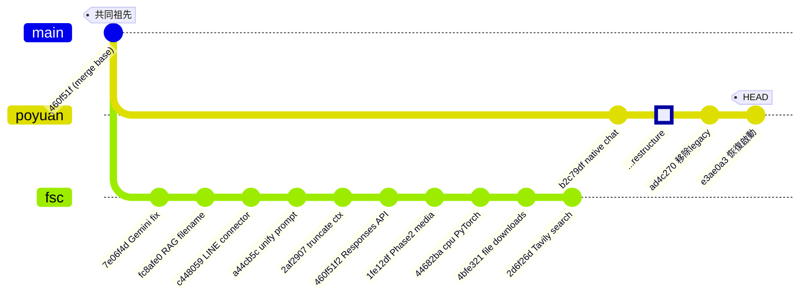

# poyuan → fsc 分支合併分析報告

## 分支拓撲概覽



> [!IMPORTANT]
> 兩個分支從 `460f51f` 分叉，各自有 **10+ 個獨立 commit**，大量核心檔案被雙方同時修改但方式不同。

---

## Dry-Run Merge 結果

執行 `git merge --no-commit --no-ff origin/poyuan` 後結果：

| 狀態 | 檔案 | 說明 |
|------|------|------|
| ❌ **CONFLICT (content)** | `Dockerfile` | 雙方都修改了 pip install 和 CMD |
| ❌ **CONFLICT (modify/delete)** | `router.py` | poyuan 刪除，fsc 有修改 |
| ❌ **CONFLICT (content)** | `server/adapters/openai_adapter.py` | 雙方大量修改 |
| ❌ **CONFLICT (content)** | `server/integrations/line_connector.py` | 雙方大量修改 |
| ✅ Auto-merged | `server/core/uma_core.py` | 自動合併成功 |
| ✅ Auto-merged | `server/adapters/__init__.py` | 自動合併成功 |

---

## 逐檔案風險分析

### 🔴 高風險 (需要手動處理)

---

#### 1. `Dockerfile`

| 面向 | poyuan 版本 | fsc 版本 |
|------|-------------|---------|
| pip install | 加入 retry 邏輯 + `setuptools wheel` | 分開安裝 `torch --index-url cpu` + `requirements.txt` |
| CMD | `server.app:app` | `router:app` |
| ENV | 新增 `PIP_DISABLE_PIP_VERSION_CHECK` 等 | 無 |

> [!CAUTION]
> **合併建議**：採用 poyuan 的 `CMD ["uvicorn", "server.app:app"]` 和 pip ENV，但**必須保留** fsc 的 `pip install torch --index-url cpu` 那行（避免 CUDA bloat），在 retry loop 中加入。

---

#### 2. `router.py` (modify/delete 衝突)

- **poyuan**：已刪除，所有路由遷移至 `server/routes/*.py` + `server/app.py`
- **fsc**：新增了 `/downloads/{filename}` endpoint 和 `FileResponse` 邏輯

> [!CAUTION]
> **合併建議**：接受 poyuan 的刪除，但必須將 fsc 新增的 `/downloads/{filename}` endpoint 遷移到 poyuan 的 `server/routes/workspace.py` 中。

---

#### 3. `server/adapters/openai_adapter.py`

fsc 的重大改動（都必須保留）：

| 改動 | 說明 |
|------|------|
| `get_tools()` | D-06 過濾 + D-07 最小化 schema，`core_execution_tools` 白名單 |
| `_handle_attached_file()` | `type: "image_url"` → `type: "input_image"` (Responses API) |
| 視覺文件注入 | `type: "text"` → `type: "input_text"` |
| `chat()` 主迴圈 | 完整遷移到 Responses API streaming format |
| `simple_chat()` | fsc 新增的純對話方法 |

poyuan 版本保留了舊版 Chat Completions API 邏輯。

> [!CAUTION]
> **合併建議**：以 **fsc 版本為主**，保留所有 Responses API 遷移。poyuan 只改了 import path（已通過 `server/adapters/` 目錄位置解決）。

---

#### 4. `server/integrations/line_connector.py`

兩個分支各自有一版 LINE connector：

| 面向 | poyuan 版本 | fsc 版本 (根目錄 `line_connector.py`) |
|------|-------------|--------------------------------------|
| 位置 | `server/integrations/line_connector.py` | 根目錄 `line_connector.py` |
| import 路徑 | `server.core.session`, `server.adapters` | `core.session`, `adapters` |
| 功能 | 基本 webhook + 文字處理 | Phase 2: 多媒體、文件預處理、Reply/Quote、Tavily 搜尋、`@Agent K` |

> [!CAUTION]
> **合併建議**：以 **fsc 的功能為主**，但使用 **poyuan 的檔案位置** (`server/integrations/line_connector.py`)，並將 import 路徑更新為 `server.*` 格式。

---

### 🟡 中等風險 (自動合併成功但需驗證)

---

#### 5. `server/core/uma_core.py`

Git 自動合併成功。兩邊的變更方向一致（D-02 knowledge-type skill 改為 reference tools），應可正常工作。

> [!WARNING]
> 建議合併後**手動驗證**技能載入是否正確。

---

#### 6. `main.py`

- poyuan：`from core.uma_core` → `from server.core.uma_core`，`router:app` → `server.app:app`
- fsc：未修改 import，但保留 `router:app`

**合併建議**：採用 poyuan 版本（import 路徑更新 + 新 entrypoint）。

---

#### 7. `auto_agent.py`

- poyuan：所有 import 改為 `server.*` 路徑
- fsc：保留舊 import

**合併建議**：採用 poyuan 版本。

---

#### 8. `requirements.txt`

- poyuan：新增 `faiss-cpu>=1.7.4`
- fsc：新增 `requests`, `line-bot-sdk`, `tavily-python` 等

**合併建議**：合併雙方新增的套件（無衝突）。

---

### 🟢 低風險

---

#### 9. `.env.template`

- poyuan：`SKILLS_HOME=Agent_skills/skills` + 新增 `MCP_CHAT_NATIVE=false`
- fsc：`SKILLS_HOME=./skills` + 有 LINE API keys

**合併建議**：採用 poyuan 的 `SKILLS_HOME` 路徑和 `MCP_CHAT_NATIVE`，保留 fsc 的 LINE keys。

---

#### 10. `.github/workflows/deploy.yml`

- poyuan：移除 `docker image prune -f`
- fsc：新增 `docker image prune -f`

**合併建議**：保留 fsc 的 `docker image prune -f`（解決伺服器空間不足問題）。

---

#### 11. `docker-compose.yml`

- poyuan：新增 `./server:/app/server` volume mount

**合併建議**：直接採用 poyuan 版本，新增的 mount 是為了 live update。

---

#### 12. `.gitignore`

Binary diff，需比對內容。低風險，可合併。

---

#### 13. poyuan 新增的檔案 (全部為新增，無衝突)

| 目錄 | 檔案 | 用途 |
|------|------|------|
| `frontend/` | `index.html`, `src/css/*`, `src/js/*` | 重新設計的前端 UIUX |
| `server/` | `app.py` | 新 FastAPI 入口 |
| `server/routes/` | `chat.py`, `documents.py`, `models.py`, `skills.py`, `workspace.py`, `resources.py` | 路由模組化 |
| `server/services/` | `chat_core.py`, `chat_service.py`, `prompt_cache.py`, `runtime.py` | 服務層 |
| `server/schemas/` | `chat.py`, `documents.py`, `resources.py`, `skills.py` | Pydantic schemas |
| `server/dependencies/` | `retriever.py`, `session.py`, `uma.py` | DI 依賴 |
| `server/nlp/` | `tokenizer.py`, `tool_selector.py` | NLP 工具 |
| `server/adapters/` | `base.py`, `factory.py` | Adapter 基類和工廠 |
| `docs/reports/` | 3 個 .md 報告 | 重構文件 |

> 這些檔案全部接受，無衝突。

---

#### 14. fsc 獨有功能檔案（需保留）

| 檔案 | 說明 |
|------|------|
| `line_connector.py` (根目錄) | 將遷移至 `server/integrations/` |
| `static/app.js` | 將被 `frontend/src/js/` 取代（poyuan UIUX 改版） |
| `static/index.html` | 將被 `frontend/index.html` 取代 |
| `static/style.css` | 將被 `frontend/src/css/` 取代 |
| `scripts/test_line_webhook.py` | 保留（測試腳本） |
| `start_server.bat` | 保留 |
| `test_*.py` files | poyuan 將 `test_phase1.py` 移到 `tests/`，其餘可保留在根目錄 |

---

#### 15. poyuan 刪除的檔案

| 檔案/目錄 | 說明 | 建議 |
|-----------|------|------|
| `skills_backup/` | 大量備份技能檔案 | ✅ 接受刪除 |
| `static/index.html` | 舊 UI | ✅ 接受刪除（被 `frontend/` 取代） |
| `static/style.css` | 舊 CSS | ✅ 接受刪除 |
| `router.py` | 舊路由入口 | ✅ 接受刪除（遷移 download endpoint 後） |
| `test_responses*.py` | 舊測試 | ⚠️ 建議保留（fsc 新增） |
| `workspace/downloads/*` | 測試檔案 | ✅ 可接受刪除 |

---

## 建議合併策略

> [!IMPORTANT]
> **不建議直接 `git merge`**，太多檔案位置重構 + 功能邏輯差異。建議採用以下分步策略：

### Step 1: 建立合併分支
```bash
git checkout fsc
git checkout -b merge/poyuan-into-fsc
git merge --no-commit --no-ff origin/poyuan
```

### Step 2: 逐一解決衝突（按優先順序）
1. **`Dockerfile`** — 合併 poyuan 結構 + 保留 fsc 的 torch cpu install
2. **`router.py`** — 接受刪除，將 download endpoint 遷移到 `server/routes/workspace.py`
3. **`server/adapters/openai_adapter.py`** — 以 fsc 版為主（Responses API）
4. **`server/integrations/line_connector.py`** — 以 fsc 功能為主，更新 import 路徑

### Step 3: 手動整合（非衝突但需注意）
1. 確認 `server/services/chat_core.py` 的 OpenAI adapter 調用是否兼容 fsc 的 Responses API
2. 確認 `.env.template` 合併結果
3. 確認 `deploy.yml` 保留 `docker image prune`

### Step 4: 驗證
1. 啟動 server (`python main.py`) 確認無 import error
2. 訪問 `/ui` 確認 frontend 頁面正常載入
3. 測試 `/chat` API 確認 OpenAI Responses API 正常運作
4. 測試 LINE webhook 確認 connector 功能正常

---

## Verification Plan

### 自動測試
```bash
# 1. 確認無 Python import 錯誤
python -c "from server.app import app; print('OK')"

# 2. 啟動 server 並檢查是否正常
python main.py
# 確認 log 中無 ImportError / ModuleNotFoundError
```

### 手動驗證
1. **使用者操作**：合併完成後在本地啟動服務，訪問 `http://127.0.0.1:8000/ui` 確認 poyuan 的新 UIUX 正常顯示
2. **Chat 測試**：在 UI 中發送訊息，確認 Responses API 路徑正常回應
3. **LINE 測試**：使用 ngrok 暴露本地服務，從 LINE 發送訊息確認 webhook 正常接收與回覆
