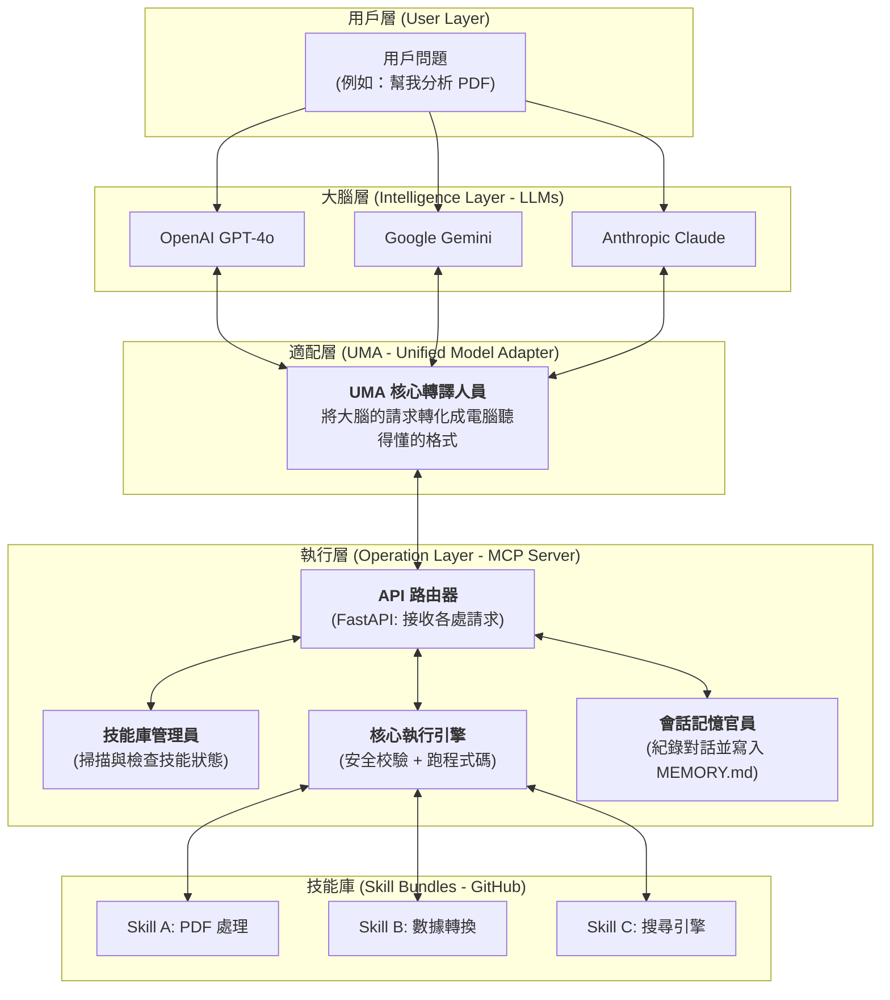

# MCP Server 完整架構技術報告 (V1)

---

## 1. 系統核心概念 (System Concept)

**MCP Server** 的全名是 **Model Context Protocol Server**（模型上下文協議伺服器）。

**白話文解釋：**
想像你買了一個超級聰明的「大腦」（LLM，如 GPT-4 或 Gemini），但這個大腦沒有手腳，也看不到你電腦裡的檔案。MCP Server 就是幫這個大腦裝上的**「通用義肢」**與**「外掛插座」**。
它定義了一套標準，讓大腦知道它有哪些工具可以使用，並且提供一個安全的通道讓大腦去執行這些工具（Skills）。

---

## 2. 整體架構流程圖 (Architecture Diagram)

---

## 3. 核心元件與白話文解釋

### A. UMA (Unified Model Adapter) — **統一模型適配器**
*   **功能：** 不同的大腦（OpenAI, Gemini）說的話格式都不一樣。UMA 就像一個**「即時口譯員」**，不管大腦傳來的是什麼格式，它都統合成 MCP Server 聽得懂的語言；反之，它也會把電腦執行的結果，轉換成大腦看得懂的格式。
*   **白話：** 萬用轉接頭，讓不同型號的大腦都能插在同一個插座上。

### B. Skill Registry — **技能註冊表**
*   **功能：** 啟動時掃描 `skills/` 目錄，檢查每個技能的 `SKILL.md`（說明書）是否寫對，以及環境依賴（Dependency）是否裝好。
*   **白話：** 管理員。負責檢查今天有哪些工具可以開工，哪些工具因為壞了（缺插件）需要掛上「維修中」的牌子。

### C. Execution Engine — **執行引擎**
*   **功能：** 真正啟動子程序（Subprocess）去跑 Python 腳本。它還負責最重要的事情：**「路徑安全性 (Sanitization)」**。
*   **白話：** 肌肉與保全。筋肉負責搬重物（跑程式），保全負責盯著大腦，不准它亂跑去偷看系統核心檔案或刪除 C 磁碟。

### D. Session Manager & MEMORY.md — **會話管理器與持久記憶**
*   **功能：** 追蹤這一次對話做了什麼，結束後讓 LLM 自己寫一段「今天學到了什麼」傳回來的摘要，存進 `MEMORY.md`。
*   **白話：** 聯絡簿與週誌。紀錄大腦今天做了哪些功課，下次開機先讀一下上次的週誌，大腦就不會失憶。

---

## 4. 專有名詞對照表 (Glossary)

| 專有名詞 | 白話文解釋 |
| :--- | :--- |
| **JSON Schema** | 給電腦看的「資料夾標記表」。規定模型要丟哪些參數進來，像是姓名、日期、檔案路徑。 |
| **Metadata (元數據)** | **「書本的索引」**。不看內容，只看書名、作者、版本，幫助系統快速找到需要的 Skill。 |
| **Dependency (依賴項)** | **「配件」**。例如這個 Skill 要用到處理 Excel 的功能，那系統就要裝好 Excel 插件。 |
| **Endpoint (端點)** | **「大門」**。API 的門牌號碼，例如 `/tools` 是專門看工具列表的門，`/execute` 是專門用來跑程式的門。 |
| **Degraded Mode (降級模式)** | **「缺件運行」**。也就是雖然工具還在，但因為少了一些配件不能全功能運作，先標記為不可用，但不影響整台伺服器崩潰。 |
| **Token (標記/點數)** | **「對話燃料」**。LLM 說話是要錢的，越長越貴。我們透過摘要與篩選來節省燃料。 |

---

## 5. 執行流程流程 (Execution Flow)

### 一個指令是如何從用戶到達成結果？

1.  **用戶提出要求：** 「幫我把 `hello.txt` 轉成大寫。」
2.  **大腦讀取工具說明書：** LLM 從 `/tools` 看到有個 `mcp-sample-converter` 工具，說明書寫著它可以轉大寫。
3.  **大腦決定出手：** LLM 產生一個 `tool_call` 請求，裡面包含參數：`{"input_text": "hello.txt", "operation": "uppercase"}`。
4.  **適配器 (UMA) 接收：** UMA 接到後，確認這個請求合法。
5.  **執行引擎 (Exec) 出動：**
    *   檢查路徑：`hello.txt` 在不在 `skills/` 範圍內？（保全檢查）。
    *   注射參數：把資料塞進環境變數中。
    *   跑程式：啟動一個小分身跑 Python。
6.  **結果回傳：** 程式吐出 `HELLO.TXT`。
7.  **記憶紀錄：** Session Manager 記下一筆「14:00 執行了轉換工具」。
8.  **大腦回覆：** LLM 整合結果，回覆用戶：「已經處理好了，請看：HELLO.TXT」。

---

> [!TIP]
> **本架構的核心優勢**：
> 1. **極高可擴展性**：新增功能只需在 `skills/` 丟一個資料夾，主程式完全不用改。
> 2. **安全性**：模型被鎖在沙箱中，無法存取外部敏感檔案。
> 3. **跨模型同步**：一次開發，GPT/Gemini/Claude 共用同一套技能。
