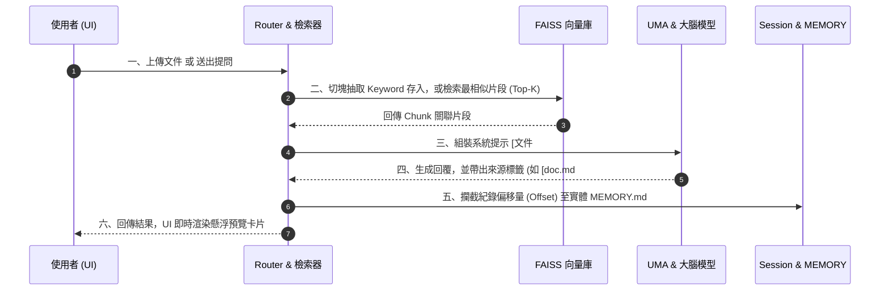
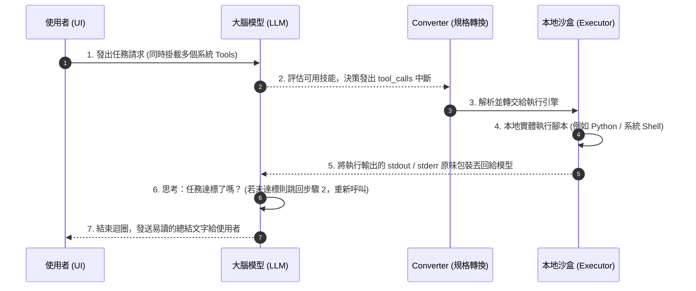

# MCP 伺服器：Sprint 1 ~ Sprint 4 架構與工作流程總結報告

這份文件旨在統整自 Sprint 1 啟動以來，至 Sprint 4 完工為止，我們為這套 **AI Agent (Hand-Brain) 架構** 所奠定的核心基礎、模組分工，以及資訊流動的關鍵機制。適合用於團隊會議報告、技術傳承，以及作為未來 Sprint 擴充的技術地圖。

---

## 1. 系統願景與設計哲學 (Design Philosophy)

我們的系統不只是一個單純的「聊天機器人」，而是一個具備「感知 (感知本地文件與知識)」與「行動 (動態呼叫程式碼、爬蟲、系統工具)」能力的 **Autonomous Agent 平台**。

核心設計哲學包含：
1. **Model-Agnostic (無痛換腦機制)**：一套底層平台，透過抽象介面隨時切換 OpenAI、Gemini 或 Claude，系統架構完全一致，賦予最大業務彈性。
2. **Def-as-Prompt (定義即提示詞)**：所有外部技能 (Skills) 都不寫死在程式碼中，而是存於附屬資料夾的 `SKILL.md`，由系統動態載入並轉換為各模型的 JSON Schema 注入 System Message 內。
3. **Local-First RAG (本機向量知識庫優先)**：不上傳外部雲端向量庫，使用本機的 FAISS 與 watchdog 即時目錄監控，做到資料不落地的進階檢索增強生成 (Retrieval-Augmented Generation)。
4. **Human-in-the-Loop (風險收束)**：對於具修改、刪除高風險屬性的工具操作，具備卡控機制，確保使用者同意後才放行執行。

---

## 2. 系統核心架構拆解 (System Modules)

系統採用 `FastAPI` 建立輕量化後端，搭配 Vanilla Javascript 的精簡前端。後端核心模組拆分為四大支柱：

```mermaid
graph TD
    classDef ui fill:#E1F5FE,stroke:#0288D1,stroke-width:2px;
    classDef router fill:#FFF3E0,stroke:#F57C00,stroke-width:2px;
    classDef core fill:#E8EAF6,stroke:#3F51B5,stroke-width:2px;
    classDef model fill:#F3E5F5,stroke:#7B1FA2,stroke-width:2px;
    classDef data fill:#E8F5E9,stroke:#388E3C,stroke-width:2px;

    UI[前端 UI<br/>(Vanilla JS)]:::ui -->|HTTP/API| Router[HTTP Router<br/>(FastAPI)]:::router
    
    subgraph 核心模組 (Core Engine)
        Router --> UMA[UMA 核心總線<br/>(Unified Model Adapter)]:::core
        Router -.-> SessionManager[Session Manager<br/>(記憶管理)]:::data
        Router -.-> Retriever[文件檢索<br/>(Retriever)]:::data
        
        UMA --> Registry[技能註冊表]:::core
        UMA --> Converter[規格轉換器]:::core
        UMA --> Executor[執行引擎]:::core
    end
    
    subgraph 知識叢 (Knowledge & Memory)
        Watcher[Watcher 即時守衛]:::data -.->|Hot Reload| FAISS[(FAISS 向量庫)]:::data
        Retriever --> FAISS
        SessionManager --> Memory[(MEMORY.md)]:::data
    end
    
    subgraph 大腦層 (Adapters)
        UMA --> OpenAI[OpenAI Adapter]:::model
        UMA --> Gemini[Gemini Adapter]:::model
        UMA --> Claude[Claude Adapter]:::model
    end

    Executor --> Scripts[腳本運行]:::core
    OpenAI -.->|Tool Call| Executor
    Gemini -.->|Tool Call| Executor
```

### 🧱 [基礎核心層] UMA (Unified Model Adapter)
UMA 是整個 Agent 系統的心臟，隱蔽了不同模型的底層差異，統籌底下三大引擎：
- **`core/registry.py` (技能註冊表)**：負責啟動時掃描 `Agent_skills/skills` 資料夾，讀取每一個技能的 `SKILL.md` YAML Metadata 與 Markdown。
- **`core/converter.py` (規格轉換器)**：將統一定義的 YAML 參數，精準轉換為各大模型要求的 Tool / Function Calling JSON Schema (Sprint 4 加入了嚴格的迴圈遞迴小寫轉換機制，確保相容性)。
- **`core/executor.py` (本地執行引擎)**：當模型決定呼叫工具時，由它負責實際啟動對應的 `scripts/run.*`，並透過抽象路徑檢查防堵跳脫目錄 (Directory Traversal) 攻擊。

### 🧠 [大腦交涉層] Model Adapters
負責與各大 LLM 供應商 API 實質對接。統一對外拋出 `chat` 與 `simple_chat` 介面：
- **`GeminiAdapter`**: 穩定支援 Google 模型原生 Tool Declaration 以及附檔圖像解析。
- **`OpenAIAdapter` (Sprint 4 完成)**: 嚴格對接 OpenAI Function Calling Schema，並實作了本地圖片轉 Base64 `image_url` 的支援，具備多模態視覺解析能力。
- **`ClaudeAdapter`**: 已預留介面與基本對話支援，供未來切換使用。
> **💡 技術突破**：Adapter 內部各自實作了**完整連續的 Tool Calling Loop**。在到達 `MAX_ITERATIONS` 之前，模型可以自主呼叫 A 工具觀察結果、不滿意再呼叫 B 工具重試，完全由模型主導思考。

### 📚 [記憶與知識層] RAG & Session Manager
- **`core/retriever.py` (知識檢索中樞)**：使用 HuggingFaceEmbeddings 與本機 FAISS 資料庫。在向量化前會額外利用 LLM 自動提取關鍵字 (Meta-Keywords) 加權注入。
- **`core/watcher.py` (即時同步神經)**：採用背景 `watchdog` 監聽。`Workspace` 文件庫與 `Agent_skills` 的變更都會即時 (Hot-swapping) 被同步進 FAISS 以供檢索，開發者更新技能無須重啟 Server。
- **`core/session.py` (對話管理員)**：統一掌管多模型共用的對話歷史 (包含智能 Token 壓縮與清除)。它也肩負攔截 AI 產生的 `[filename#chunk:snippet]` 引用標籤，並長久歸檔至實體 `MEMORY.md` 供人工稽核的重任。

### 📡 [介面層] HTTP Router & 前端 UI
- **`router.py`**: 作為 API 的玄關口。負責分流聊天、文件上傳、RAG 查詢等需求，處理執行模式 (Execute Mode) 判定標記，將上下文 (Execution Context + Session History) 組裝妥當後丟給 Adapter。
- **前端 Web 介面 (`index.html` / `app.js`)**: 實作了「切換大腦(模型)」、「長文件 RAG 進度條顯示」、「知識庫檔案上傳與即時移除」、「單一技能沙盒試驗權限指派」、以及「來源引用 (Citation) 漂浮窗預覽」等豐富介面。

---

## 3. 工作流程全景圖 (End-to-End Workflow)

以下介紹三個最為核心的實戰流程：

### 流程一：技能零配置上線 (Zero-Config Tool Injection)
1. **Server 啟動與監聽**：`UMA` 實例化，`SkillRegistry` 去掃描 `skills/` 資料夾尋找 `SKILL.md`，放入暫存記憶。`watchdog` 即刻背景排班。
2. **大腦選取轉換**：當使用者選擇模型 (例如 OpenAI) 並勾選了對應的技能 (例如 `mcp-python-executor`)，程式會透過 `core/converter.py` 將該技能參數，動態渲染成 OpenAI 專屬的 Tool Definition API JSON Schema 規格套用至此回合。
3. **無縫更新**：若開發者臨時新增一個技能，只要放入目錄，`watchdog` 觸發事件、重設註冊表，下一次 API 呼叫系統就能立刻派上用場。

### 流程二：本地 RAG 漂浮引用 (Context-Grounded Generation)



1. **資料熱入庫**：使用者拖曳 PDF 或 Markdown 進 UI。後端非同步切割文本，利用 FAISS 加上 Meta-Keywords 加權存入本地存放區中。
2. **知識檢索交鑰匙**：提問進來後，先到檢索器比較語義相似度，抽出 Top-K 最符合的片段。
3. **組裝防護提示**：將包含 `[路徑#chunk_X:原始段落]` 的龐大 Context 包裝進 System Prompt 給模型，強制要求模型嚴格遵從標籤引用規範。
4. **追蹤與重構**：模型生成如 `"此專案的核心架構分為三塊 [architecture.md#chunk_1:系統核心分為...]"` 的回覆，`SessionManager` 正則攔截將此次偏移索引記到 `MEMORY.md`。而前端 UI 則自動渲染成為懸浮卡片讓使用者查閱。

### 流程三：全自主打擊行動 (Agentic Executor Loop)



1. **啟動權杖放行**：使用者提出「幫我把資料夾下所有的 Excel 都轉成 CSV」。
2. **第一階段決策**：模型評估提問，回傳第一個 `tool_calls` 要求使用 `mcp-python-executor` 來寫 python code 列出檔案。
3. **後端封裝與執行**：Adapter 攔截到工具呼叫，不再回傳給使用者，而是直接丟給 UMA 調用 `core/executor.py`。
4. **沙盒輸出返回**：引擎將 Shell 印出的 `stdout` (例如 `[file1.xlsx, file2.xlsx]`) 原封不動作為 Message 再丟給模型。模型發現有檔案再丟出第二個 `tool_calls` 開始進行轉檔動作。
5. **最終總結**：直到任務完成，模型發現不需要撰寫程式碼了，隨後整理出一套人類易讀的話語發送至 UI，達成「Hand-Brain」聯動的完全自主。

---

## 4. 關鍵里程碑成就回顧 (Sprint 1 ~ 4 Highlights)

- ✅ **純離線且即時的知識心臟**：以 FAISS 放棄 ChromaDB 的系統相容問題，並做到資料夾「有變更即反映檢索」，不再需要冗長的整批重啟作業。
- ✅ **精準來源引用 Offset 追蹤**：AI 再也不會胡亂編造來源。介面可以準確告訴使用者這句話出自「哪份文件的哪個區塊 (Chunk)」，大幅提升企業內部信任度。
- ✅ **模型多樣化並行**：完成了 Gemini 與 OpenAI 最新 GPT-4o 規格 API 的並存測試，並且在多模態圖片 (Base64 vs 原生 Upload) 與對話管理 (歷史訊息重組、收斂) 上，讓不同廠商的行為幾乎保持一致與無縫切換。
- ✅ **無阻力技能擴展性 (OCP 原則落地)**：未來其他部門若想要開發生產力大腦（例如請教資料分析策略），只需要撰寫 `SKILL.md` 的文字檔放入庫中，就自動成為智能系統強大武裝的一環。

> **下一步預告 (Next Phase Vision)**：
在打通了完整的檢索與迴圈執行能力後，未來可以鎖定：
1. **Multi-Agent / Planner**：導入更頂層的「規劃者模組」，分析複雜使用者意圖後將任務拆分成多棵子樹，分批指派不同的 Worker AI 來依序結案。
2. **企業外部溝通橋樑**：整合更多如 LINE、Microsoft Teams 等即時通訊橋接 (Bridge) 技能，將系統送出舒適圈走向實戰接客。
