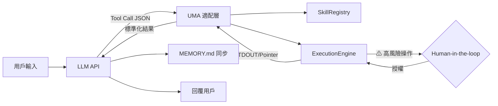

# UMA 整合主程式：詳細執行報告 (v2)

本報告說明如何將 **UMA (Unified Model Adapter)** 核心組件整合進主程式，使 LLM 能透過標準 API 調用 GitHub Skills。

---

## 1. 整合目標



---

## 2. 執行順序 (Revised)

> [!IMPORTANT]
> 依據「先穩後擴」原則，**安全性與環境預檢**已提前至第二階段，確保系統在開放外部接口前即具備完整防護。

### Phase 1：地基 — 進入點 + 環境預檢
| 項目 | 說明 |
| :--- | :--- |
| **做什麼** | 建立 `main.py`，整合環境變數載入與 **依賴預檢 (Runtime Check)** |
| **為何** | 統一啟動流程。當 `SkillRegistry` 掃描到 `runtime_requirements` 中的庫未安裝時，系統進入**降級模式**，在 `/tools` 路由中標註該工具 `[UNAVAILABLE]`，而非等到執行時才報錯 |

**降級模式邏輯：**
```python
# main.py
uma = UMA(skills_home="./skills")
uma.initialize()  # 掃描 + 依賴預檢

# 啟動時即輸出環境報告
for skill, data in uma.registry.skills.items():
    if not data["metadata"]["_env_ready"]:
        print(f"⚠ {skill}: 降級模式 (缺少: {data['metadata']['_missing_deps']})")
```

---

### Phase 2：安全性 — 路徑校驗與沙箱隔離
| 項目 | 說明 |
| :--- | :--- |
| **做什麼** | 強化 `sanitize_path` 並實作沙箱邊界 |
| **為何** | 安全性是整個系統的紅線。必須在任何外部介面開放前，確保路徑清理、目錄穿越防護皆已就緒。跨平台路徑處理使用 `pathlib` 統一 `\` 與 `/` |

> [!WARNING]
> **Case Sensitivity 陷阱**：Windows 大小寫不敏感，Linux 大小寫敏感。在路徑校驗與 `SkillRegistry` 索引時，統一將技能名稱轉為**小寫 (lower-case)** 進行比對，確保跨系統一致性。

```python
# 路徑比對時統一小寫
skill_key = skill_dir.name.lower()  # 確保 "MCP-Tool" 與 "mcp-tool" 視為同一技能
```

---

### Phase 3：骨架 — FastAPI 路由層
| 項目 | 說明 |
| :--- | :--- |
| **做什麼** | 建立 HTTP 端點，接收 LLM 的工具調用請求 |
| **為何** | 定義「外部如何與 UMA 溝通」的標準接口 |

**路由定義（含優化）：**
| 路由 | 方法 | 新增特性 |
| :--- | :--- | :--- |
| `/tools` | GET | 降級工具標記 `[UNAVAILABLE]` |
| `/execute` | POST | 支援 Human-in-the-loop 狀態碼 |
| `/resources/{skill}/{file}` | GET | **新增 `?limit=500` 字數限制參數**，節省 Token |
| `/search/{skill}/{file}` | POST | Grep 搜尋，結果上限 50 筆 |
| `/health` | GET | 含依賴就緒狀態概覽 |

> [!TIP]
> `/resources` 路由強制要求 `limit` 參數，挑戰每條資訊是否值得其 Token 成本。預設 500 字元，超過則回傳摘要與 Pointer。

---

### Phase 4：神經 — 適配器與 LLM 串接 (OpenAI / Gemini / Claude)
| 項目 | 說明 |
| :--- | :--- |
| **做什麼** | 實作三大模型的雙向 Tool Call 通訊 |
| **為何** | UMA 的核心價值——橋接模型與技能。**Claude 支援已納入**，與 OpenAI/Gemini 同等優先 |

**新增：動態工具注入 (Dynamic Tool Injection)**
> [!IMPORTANT]
> 對於擁有大量 Skills 的 Repo，一次將所有 Schema 送給 LLM 會佔用過多 Context。各 Adapter 實作**兩階段篩選**，僅送出 **5-15 個最相關工具**。

**兩階段篩選策略：**
1. **第一階段 — 標籤匹配 (Tag Matching)**：`SkillRegistry` 啟動時預先為每個技能的 `description` 提取一組標籤 (Tags)。篩選時優先匹配標籤。
2. **第二階段 — 語義回退 (Semantic Fallback)**：若標籤匹配不到足夠工具，回退至全文語義搜尋。

```python
# adapters/openai_adapter.py (概念)
def select_relevant_tools(user_query: str, all_tools: list, max_tools: int = 10):
    """兩階段篩選：標籤優先，語義回退"""
    # Phase 1: Tag matching
    tag_matched = [t for t in all_tools if any(tag in user_query.lower() for tag in t.get("_tags", []))]
    if len(tag_matched) >= max_tools:
        return tag_matched[:max_tools]
    
    # Phase 2: Semantic fallback (補足不夠的部分)
    remaining = [t for t in all_tools if t not in tag_matched]
    scored = [(semantic_score(user_query, t["function"]["description"]), t) for t in remaining]
    scored.sort(reverse=True)
    return (tag_matched + [t for _, t in scored])[:max_tools]
```

**三模型適配器：**
| 檔案 | 模型 | 格式 |
| :--- | :--- | :--- |
| `adapters/openai_adapter.py` | GPT-4o / GPT-4 | `tools` / `function` |
| `adapters/gemini_adapter.py` | Gemini Pro / Flash | `FunctionDeclaration` |
| `adapters/claude_adapter.py` | Claude 3.5 / Opus | `tools` JSON |

---

### Phase 5：衛生 — Session 管理 + MEMORY.md 同步
| 項目 | 說明 |
| :--- | :--- |
| **做什麼** | 為每次對話建立 Session，並在結束時觸發 Cleanup 與 **MEMORY.md 更新** |
| **為何** | Cleanup 防止磁碟爆炸。MEMORY.md 讓 Agent 在下次啟動時「記得」上次做了什麼，賦予系統「靈魂」 |

**MEMORY.md 同步機制：**
```
Session 建立 → 工具調用（可能多輪）→ Session 結束
    ├─ Cleanup Job：刪除臨時數據
    └─ Memory Sync：將本次對話摘要寫入 MEMORY.md
```

---

### Phase 6：驗收 — E2E 測試
| 項目 | 說明 |
| :--- | :--- |
| **做什麼** | 以真實 API Key 進行完整流程測試 |
| **為何** | 僅靠單元測試無法覆蓋模型行為的不確定性 |

**測試清單：**
- [ ] OpenAI / Gemini / **Claude** 工具註冊與調用
- [ ] 動態工具注入（驗證僅注入相關工具）
- [ ] 大檔案流式處理 + limit 參數
- [ ] 路徑安全性（目錄穿越）
- [ ] 依賴缺失降級行為
- [ ] **Human-in-the-loop 授權流程**

---

## 3. Human-in-the-loop 機制

> [!CAUTION]
> 若腳本將執行具有副作用的高風險動作（刪除檔案、發送網路請求），UMA 回傳特殊狀態碼，主程式先詢問用戶授權再繼續。

| ExecutionEngine 狀態 | 處理方式 |
| :--- | :--- |
| `success` | 直接回傳 output |
| `failed` | 回傳 stderr，引導模型重試 |
| `security_violation` | 回傳「操作被拒絕」，禁止重試 |
| `error` (Timeout) | 建議模型縮小輸入範圍 |
| **`requires_approval`** | **暫停執行，回傳風險描述給用戶，等待授權** |

---

## 4. 整合後目錄結構

```
MCP_Server/
├── main.py                    ← [NEW] 進入點 + 環境預檢
├── router.py                  ← [NEW] FastAPI 路由 (含 limit 參數)
├── core/
│   ├── uma_core.py            ← [EXISTING] UMA + SkillRegistry
│   ├── executor.py            ← [UPDATE] 新增 requires_approval 狀態
│   └── converter.py           ← [EXISTING] Schema 轉譯器
├── adapters/
│   ├── openai_adapter.py      ← [NEW] 含動態工具注入
│   ├── gemini_adapter.py      ← [NEW] 含動態工具注入
│   └── claude_adapter.py      ← [NEW] 含動態工具注入
├── memory/
│   └── MEMORY.md              ← [NEW] 對話記憶持久化
├── skills/                    ← [EXISTING]
└── requirements.txt           ← [UPDATE] +fastapi, uvicorn, anthropic
```

---

## 5. 執行順序設計理由

| Phase | 名稱 | 核心理由 |
| :--- | :--- | :--- |
| 1 | 地基 | 統一初始化 + 依賴預檢降級，杜絕執行時才發現環境問題 |
| 2 | 安全性 | **紅線優先**。在開放任何外部接口前，路徑防護必須就位 |
| 3 | 骨架 | 定義外部通訊標準，含 Token 節約的 limit 機制 |
| 4 | 神經 | 三模型適配 + 動態注入，精準且經濟地橋接 LLM |
| 5 | 衛生 | Session 清理 + MEMORY.md，讓系統具備長期記憶 |
| 6 | 驗收 | 真實環境測試，覆蓋所有新增機制 |
